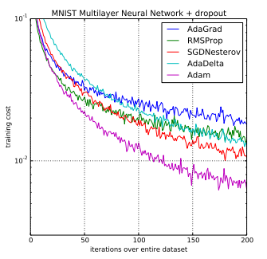
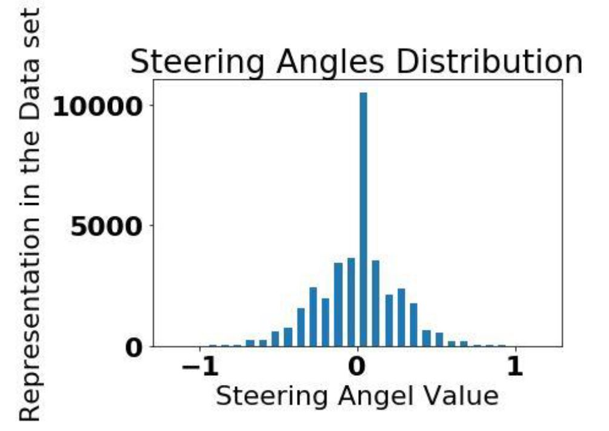
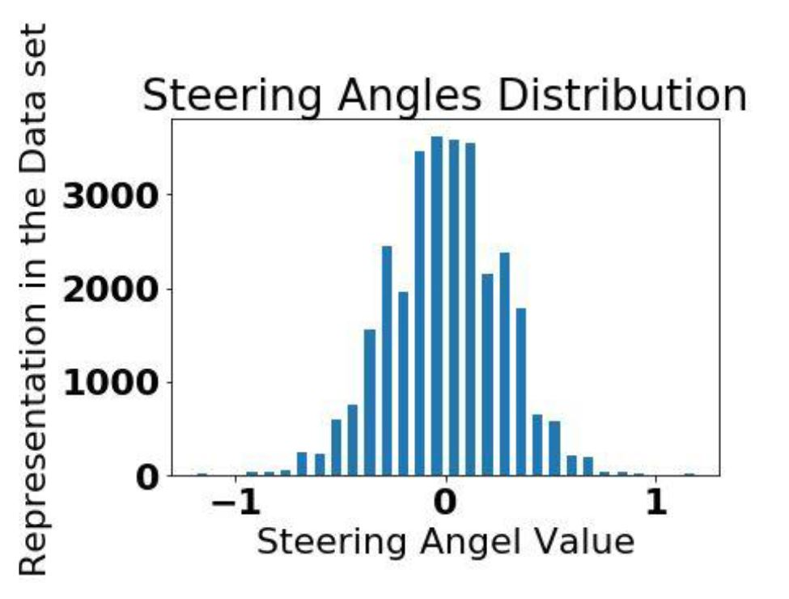
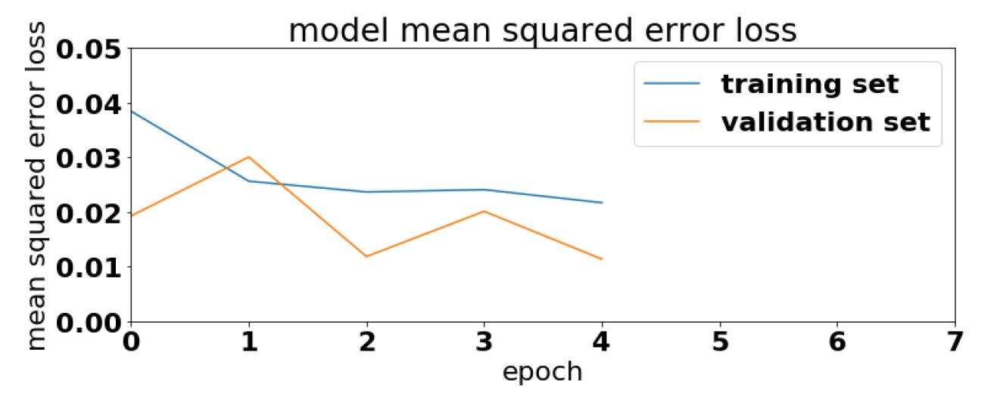

# End-to-End-Deep-Learning-for-Self-driving-Cars

## Behavioral_Cloning_Pipeline_Using_Keras

- **Project Goals:**
  - Use the simulator to collect data of good driving behavior.
  - Build, a convolution neural network in Keras that predicts steering angles from images.
  - Train and validate the model with a training and validation set.
  - Test that the model successfully drives around track one without leaving the road.
  - Summarize the results with a written report This pipeline contains the following steps:
  - Reading & Loading the Collected Data: my dataset is based on (1- Udacity collected dataset).
  
  - **Data Preprocessing: consists of three main steps:** 
    - Cropping the top and bottom redundant segments of each image as they always contain unuseful data.
    - Resizing each image to suite the model expected input shape (66,200,3).
    - Converting the image color space into YUV space as Nvidia paper recommends this.
    
  - **Data Augmentation: consists of two main steps** 
    - Data Flipping. 
    - Random Shadding. 
     
  - Data Visulaizing: Exploring random samples of the processed data and assuring the datasets balancing. 
  - Data Batching: Python generators provide us a very powerful utility that we can load a specified batch of data only when we're in need 
  for it, (i.e. so no need to load all the data set at the same time as this is most likely will not fit into our memory so we just load 
  a specified batch on a fly!). 
  - Model Training: I've implemented the architecture mentioned in this paper. 
  - Model Validation: 20% of the collected data to be considered as validation set. 
  - Visualizing both of training & validation loss to make sure that the model doesn't suffer from overfitting or underfitting.
  
##  Rubric Points
Here I will consider the rubric points individually and describe how I addressed each point in my implementation.

- **Files Submitted & Code Quality.**
  - Submission includes all required files and can be used to run the simulator in autonomous mode
My project includes the following files:
    - Behavioral_Cloning_Pipeline_based_on_Keras.py containing the script (Pipeline) to create and train the model.
    - drive.py for driving the car in autonomous mode.
    - OutputModel-ValAcc0.011382 containing a trained convolutional neural network.
    - writeup_report.pdf discussing the architecture and concluding the results.
 
- **Submission includes functional code.**
Using the Udacity provided simulator and my drive.py script, the car can be driven autonomously around the track by executing python drive.py OutputModel-ValAcc0.011382.

- **Submission code is usable and readable.**
You’ll find all of the pipeline code and clarifying comments in
Behavioral_Cloning_Pipeline_based_on_Keras.py
Model Architecture and Training Strategy
  - An appropriate model architecture has been employed.
  - Attempts to reduce overfitting in the model.
As you can see I’ve implemented the CNN published in End to End Learning for Self-Driving Cars paper.

<figure>
 
 <figcaption>
 

 
 </figcaption>
</figure>

- **Model Architecture and Training Strategy.**
- **1. Solution Design Approach.**
   - As shown The network consists of 9 layers, including a normalization layer, 5 convolutional layers with ReLU activations and 3 fully connected layers. The input image is split into YUV planes and passed to the network. The first layer of the network performs image normalization. The normalizer is hard-coded and is not adjusted in the learning process. Performing normalization in the network allows the normalization scheme to be altered with the network architecture and to be accelerated via GPU processing. The convolutional layers were designed to perform feature extraction and were chosen empirically through a series of experiments that varied layer configurations. I’ve used strided convolutions in the first three convolutional layers with a 2×2 stride and a 5×5 kernel and a non-strided convolution with a 3×3 kernel size in the last two convolutional layers. I’ve followed the five convolutional layers with three fully connected layers leading to an output control value which is the inverse turning radius. The fully connected layers are designed to function as a controller for steering, but it’s noted that by training the system end-to-end, it is not possible to make a clean break between which parts of the network function primarily as feature extractor and which serve as controller, Also I’ve added a dropout layer after the first fully connected layer as fully connected layers are much prone to over-fitting.
- **2. Model parameter tuning.** 
   - I've used Adam optimizer which is an extension of the stochastic gradient descent for this problem with learning rate = 1.0e-4. 
   - I've used MSE as a loss function as this is not a classification problem. 
   - For more info why Adam optimizer was selected >> 
      - AdamOptimizer is combining the advantages of two other extensions of stochastic gradient descent. Specifically: 
         - Adaptive Gradient Algorithm (AdaGrad) that maintains a per-parameter learning rate that improves performance on problems with sparse gradients (e.g. natural language and computer vision problems). 
         - Root Mean Square Propagation (RMSProp) that also maintains per-parameter learning rates that are adapted based on the average of recent magnitudes of the gradients for the weight (e.g. how quickly it is changing). This means the algorithm does well on online and non-stationary problems (e.g. noisy). 
         - Adam was demonstrated empirically to show that convergence meets the expectations of the theoretical analysis. Adam was applied to the logistic regression algorithm on the MNIST character recognition and IMDB sentiment analysis datasets, a Multilayer Perceptron algorithm on the MNIST dataset and Convolutional Neural Networks on the CIFAR-10 image recognition dataset. 
         
- **And here's Comparison of Adam to Other Optimization Algorithms Training a Multilayer Perceptron.**
   -Taken from Adam: A Method for Stochastic Optimization, 2015.
   
<figure>
 
 <figcaption>
 

 
 </figcaption>
</figure>

- **3. Appropriate training data.**
- **Actually I’ve tried many approaches to collect training data:**
   - 1- Using only Udacity dataset.
   - 2- Combining Udacity dataset with recovery data.
   - 3- Training on my own collected data.
   
- Finally I decided to go with only data set from Udacity as I’ve noticed that the model is performing aggressively in the steers when learn from my own data, so I aided Udacity data with some of the powerful augmentation techniques in order to increase and balance the dataset as it was firstly biased towards zero steers, by down-sampling the zero steers examples as shown.

- **1. Before Data Balance.**
- **2. After Data Balance.**

<figure>
 
 <figcaption>
 

 
 </figcaption>
</figure>

<figure>
 
 <figcaption>
 

 
 </figcaption>
</figure>

- **I’ve also splitted this dataset into 80% training set and 20% validation set.**
And in order to continuously trace the model performance on both sets I’ve plotted each of the training MSE loss and validation MSE loss against the epochs as shown below and used to always save the best model (i.e the model with the least validation loss).

<figure>
 
 <figcaption>
 

 
 </figcaption>
</figure>